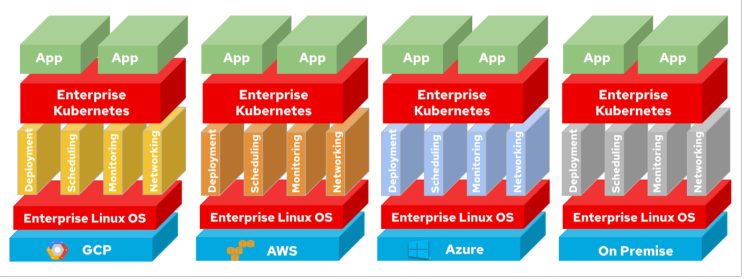
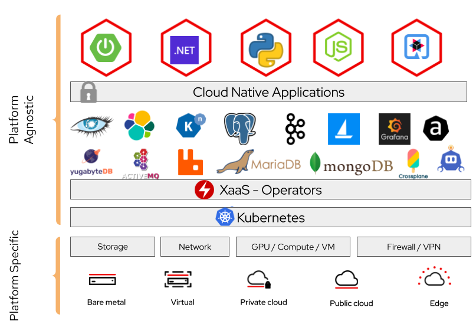
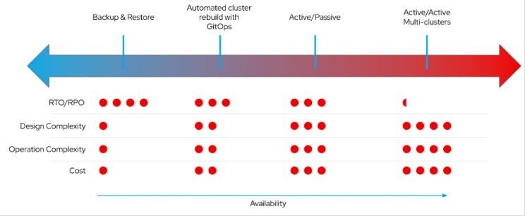
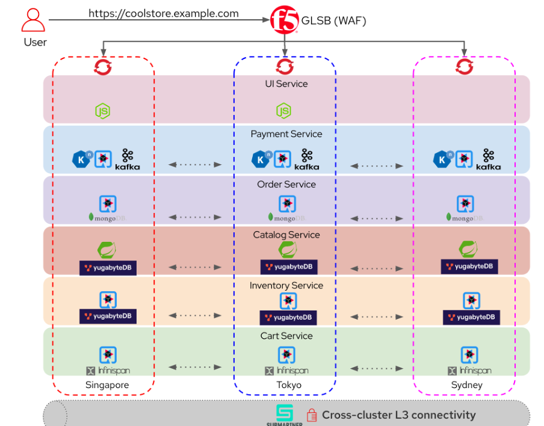

In the previous article, we discussed how outages are becoming more frequent and disrupting our daily lives. A service outage is a matter of when, not if, regardless of whether it is deployed on-premises or on the public cloud. We looked at how Kubernetes can be a common substrate to promote a standardized approach and a unified platform across different environments, to reduce the complexity of keeping our services highly resilient.

Kubernetes as the "Cloud Operating OS"

In this article, we will dive deeper into Kubernetes and how it helps to achieve workload resiliency on private or hybrid cloud. We will touch on the following topics:

- What is Kubernetes-Native
- Design patterns for application resiliency on Kubernetes
- Why Red Hat OpenShift Container Platform

## What is Kubernetes-Native Workload

The CNCF Cloud Native definition is

Cloud native technologies empower organizations to build and run scalable applications in modern, dynamic environments such as public, private, and hybrid clouds. Containers, service meshes, microservices, immutable infrastructure, and declarative APIs exemplify this approach.

Kubernetes is an open-source container orchestrator. It automates the lifecycle of containerized applications on modern infrastructures, functioning as a “data centre operating system” that manages applications across a distributed system. Kubernetes provides the automation and observability needed to efficiently manage multiple applications at the same time. The declarative, API-driven infrastructure of Kubernetes allows cloud-native development teams to operate independently and increase their productivity.

Kubernetes-native applications

Kubernetes-native is a specialization of cloud-native, specifically tailored for Kubernetes with the following advantages:

- A Kubernetes-native application is specifically built for Kubernetes, taking full advantage of its features and capabilities. This allows applications built for Kubernetes to be deployed everywhere that Kubernetes runs.
- When developing Kubernetes-native applications, developers focus on Kubernetes-specific patterns, deployment strategies, and resource management. The operator pattern is one example of how applications are taking advantage of Kubernetes.
- Abstract cloud services to provide developers with cloud-agnostic experiences. CRDs are Kubernetes API extensions that allow you to define new object types without implementing your API servers and integrating them with external systems.
- Offer Everything-as-a-Service using GitOps principles. ArgoCD is an open-source GitOps continuous delivery tool for Kubernetes. This ensures that a system’s desired state is expressed declaratively, versioned, immutable, and continuously reconciled, with Git being the single source of truth. You can now offer various services such as databases, Kafka, GPU, and Jupyter notebooks easily by using GitOps to deploy them for your users.
- Kubernetes allows easy enforcement of your runtime standards for security, compliance and observability on a single platform. Standards such as CIS, STIG and NIST can be easily applied on Kubernetes regardless of the underlying infrastructure.

## Design Patterns for Application Resiliency

There are different patterns for stateful application availability on Kubernetes. It is more complex and costly to have an application run active/active across multiple Kubernetes clusters, however, they are highly resilient. Some applications can only run active/passive for various reasons, such as a single master/writer or storage limitations.

Design patterns on Kuberrnetes

The red dots in the image represent various aspects related to different application recovery methods:

- RTO/RPO (Recovery Time Objective / Recovery Point Objective): These dots indicate how quickly data can be restored after an incident (RTO) and how much data loss is acceptable (RPO). More dots mean longer RTO/RPO.
- Design Complexity: The number of red dots reflects the complexity of designing and implementing each method. More dots imply higher complexity.
- Operation Complexity: Similarly, the red dots indicate the operational complexity of each method. More dots mean more intricate operations.
- Cost: The number of red dots represents the cost associated with each recovery method. More dots indicate higher costs (not just $).
- Availability: The arrow to the right represents increasing availability from left to right.

Depending on the SLO, here are some methods to meet the goals:

1. Backup &amp; restore: This is a snapshot in time and there will be data loss hence the RPO will never be zero, however, it is the simplest to implement.

2. Automated cluster rebuild with GitOps: It is preferred to have automation to perform cluster creation and configuration management. It doesn’t matter if you are setting up the first cluster, Nth cluster or recovering a cluster, you should have automation in place. The application can then be restored by GitOps assuming the data is safe outside the cluster.

3. Active/Passive: Many traditional applications aka not cloud-native on Kubernetes cannot active full active-active. They are dependent on their storage provider and orchestration tools for failover or failback. There is complexity because of the orchestration and there may not be zero RPO if it’s not a synchronised data replication.

4. Active/Active: This is a highly resilient deployment where the workload is deployed across active-active clusters, ideally spread across multiple AZs or cloud or data centers providers. In such a design, there is no single master or writer concept, and they can all be active at the same time. This allows the workload to scale horizontally and deploy on another Kubernetes cluster easily. However, there are factors like latency, network throughput or even data sovereignty that can affect this design.

It is important to consider the data resilience pattern too. Storage providers integration with Kubernetes has vastly improved over the years, and I see more and more storage providers can integrate from on-premises to the cloud to provide you with a seamless experience.

## Demo with Red Hat OpenShift Container Platform

OpenShift is an enterprise application platform that provides a common substrate for organizations to run on any certified infrastructure platform of choice today. It is not only based on Kubernetes but has the necessary tooling to help achieve application resilience on-premises or on the cloud, such as:

- ArgoCD: Out of the box integration with ArgoCD to simplify application deployment across a single or multiple clusters.
- Submariner: Submariner enables direct networking between Pods and Services in different Kubernetes clusters, either on-premises or in the cloud.
- Advanced Cluster Management: Manage clusters and applications from a single console, with built-in security policies.
- Prometheus: An open-source systems monitoring tool and alerting toolkit. Centralized observability is available on Advanced Cluster Management.
- OpenTelementry: OpenShift distributed tracing platform lets you perform distributed tracing, which records the path of a request through various microservices that make up an application. Developers can visualize call flows in large microservice architectures with distributed tracing. It is valuable for understanding serialization, parallelism, and sources of latency.
- Service Mesh: Based on the open source Istio project, provides an easy way to create a network of deployed services that provides discovery, load balancing, service-to-service authentication, failure recovery, metrics, and monitoring.

In this demonstration, we aim to show case active-active workloads across multiple clusters to handle failover and workload relocation capabilities. Cool store is a hypothetical shopping website that is built using microservices and various cloud-native technologies with 3 active clusters that is running with active-active workloads.

It is expected that the cool store can handle the following scenarios:

- No data loss. Not even your shopping cart!
- Tolerate the loss of a single cluster
- Able to relocate or deploy a workload easily to another cluster/region using GitOps

Demo Architecture

Here are the components used:

- GLSB for North-South Traffic: Thanks to F5 (Kok-Yong CHEONG, Chin Keng Lim Joko Yuliantoro, Davis Li) team for providing their Distributed Cloud Services (XC) as the GSLB and their assistance in getting it integrated with OpenShift. F5 XC seamlessly handle the failover of the microservices to another cluster.
- Polyglot microservices: Hosting various microservices that are built using different language frameworks such as NodeJS, SpringBoot, etc.
- Cloud-native databases: Databases are fully replicated and can survive when a cluster is down. Data resilience is handled by the database directly and independent of the underlying storage layer. Thanks to the Yugabyte team (Ai Nah Lim, Yogi Rampuria) for providing a PostgreSQL compatible and helping us to deploy on OpenShift.
- Multi Cluster Management: To provision and manage the clusters using Advanced Cluster Management (ACM). In this Cool store demonstration, we are deploying on AWS however you can run the demo across CSPS or across your data centers.
- GitOps: Multi Cluster deployment using ArgoCD and Kustomize fully integrated with ACM.
- Cross-cluster Networking: Simplification of east-west traffic for cross-cluster discovery and connectivity across clusters using Submariner provided by ACM. The developers need not be concerned on how they are going to connect to another pod. It is just another Service IP that magically routes the traffic onto another cluster. ACM establishes the IPSec gateway and connectivity between clusters for Submariner.

While we aim to demonstrate an active-active deployment to ensure a highly resilient application, it is important to note that it is also possible with an Active/Passive setup with storage orchestration on-premises or on the public cloud with OpenShift.

The Git repository is here: https://github.com/rhsgsa/hybrid-cloud-coolstore

Demo video is coming soon!

Lastly, head over to Red Hat Validated Patterns for the GitOps pattern or other related patterns that you can apply on your environment.

## Conclusion

Kubernetes provides inherent resilience for containers within the cluster. When a container (or Pod) fails, Kubernetes automatically restarts it. However, container resilience alone is not sufficient. What if the entire cluster becomes unavailable? What if the cluster runs out of capacity? To address this, you will be required to have multiple clusters for high availability. If one cluster fails, your solution can still run in another cluster. Ideally, have the clusters deployed across different data centers or regions to enhance resilience. Complex topologies spanning multiple data centers or cloud providers can lead to availability issues. Multiple smaller clusters are easier to manage, scale, and upgrade.

In summary, OpenShift application platform allows organizations to build and simplify their application deployment using cloud-native concepts and technologies. OpenShift’s flexibility, combined with the right architecture and deployment practices, ensures resilient and efficient application management.

Credits

I had the opportunity to collaborate with a great team of Solutions Architect (Kin Wai Koo Kah Hoe Lai Darrick Leong Juin Hau Ong Juncheng Anthony Lin Stephen Bylo Prempal Singh) to conceptualize and create the demo after multiple sprints, whiteboarding and late nights.

My appreciation goes to F5 Joko Yuliantoro and YugabyteYogi Rampuria for their assistance in incorporating their services with OpenShift.

Finally, to our management team Guna Chellappan Eric Vong Kelvin Loh for their input and suggestions.