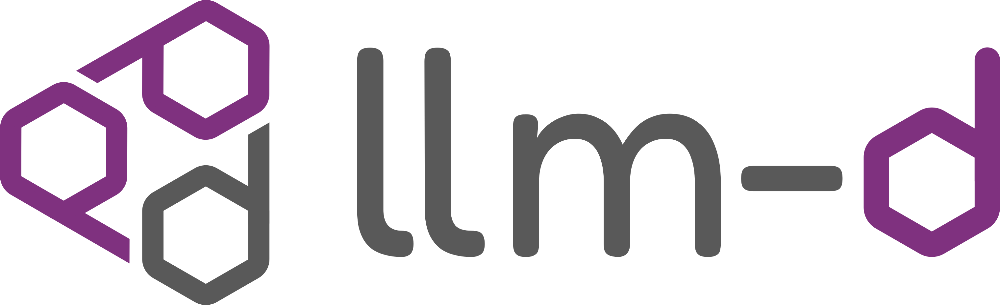

At Red Hat Summit 2025, Red Hat announced [llm-d.ai](https://llm-d.ai) project, a Kubernetes-native distributed inference serving stack. In this article, I will distil what is the value of llm-d for AIOps.

## Operational Hurdles of LLM Deployment

When it comes to inference performance, LLMs can pose a unique set of operational hurdles due to their size, complexity and computational demands, such as

| Type | Challenge |
|-| -|
| Low throughput | Concurrency limitation. Low GPU utilization. |
| High latency (ITL)| Poor user experience |
| Poor load balancing | Hotspotting or overloading |
| Cold start | Slow initial response when kv cache is missing |

As models gets bigger and more complex (MoE, MTP), the demand on compute, memory, and network infrastructure increases significantly, impacting the ability to scale inference performance. This translates into high operational expenditure (OpEx) due to energy consumption and cloud computing costs, as well as considerable capital expenditure (CapEx) for on-premises hardware.

## What is a Token Factory

In the world of Agentic AI and reasoning models, the demand for tokens is ever higher than before. Agentic AI combines planning and reasoning to create AI agents that can autonomously execute complex tasks. This workflow will demand more token throughput because of its automatous nature and multi-agent collaboration, which inherently involves more frequent exchanges of information.

An agentic workflow is chattier than a traditional chatbot and is often frequently powered by a reasoning model. Reasoning models can generate significantly more tokens compared to non-reasoning models, sometimes up to 20 times more.

In order to support this demand, a token factory will be needed. It will require:

* An optimized AI factory that is focused on generating tokens using technologies such as vLLM and hardware accelerators.
* Be sustainable and energy efficient to increase the tokens per watt/dollar.
* Scalable and resilient, ensuring it can meet fluctuating demands from the users.

In a token factory, you will frequently find vLLM as the core inference engine. vLLM is a performant inference engine that is optimized for serving large language models efficiently. It is designed to maximize throughput using features like continuous batching, paged attention and speculative decoding, leveraging hardware accelerators. These accelerators excel at highly parallel tasks required to predict the next token, however inference performance is often constrained by the available memory capacity.

However, vLLM alone is insufficient. To truly unlock its potential in the enterprise, we need a scalable, efficient, and open infrastructure. llm-d delivers that by enabling high-performance, distributed inference across heterogeneous environments.

## Why llm-d Matters for AIOps

With llm-d, we now scale our inference to meet the demands of Gen AI applications. Red Hat, in partnership with CoreWeave, Google Cloud, IBM Research NVIDIA and other companies has launched llm-d. llm-d is an open source project that focuses on addressing the challenges of high costs, resource intensity, and latency, which can reduce and limit the practical deployment of LLMs for our enterprise use cases.

LLM workload characteristic is different from http-based workload. There are many more opportunities to optimize inference load balancing compared to using a sticky session to redirect to a particular vLLM instance.

1. LLM requests are non-uniform in nature. Depending on the use cases, such as RAG, summarization or chat bot, the number of input/output tokens will be different and stresses the vLLM when the requests are compounded onto a single instance.

1. Smart routing to cache-aware instance. Certain LLM workloads such as agentic or code completion are highly repetitive in their prompts, thus can take advantage of this. 

1. llm-d paves the way for a new distributed, scalable and high-performing AI inference across the hybrid cloud, supporting any model, any accelerator, any cloud to realize the AI potential.

1. llm-d provides teams with new flexibility to switch tools, test new tech and scale efficiently without re-architecting everything.

## Conclusion

The increasing complexity and token demands of LLMs present significant operational and cost challenges for us. llm-d is an open-source, Kubernetes-native distributed inference serving stack designed to overcome these hurdles, enabling scalable, high-performing, and cost-effective LLM operations. 

In the next article, I will walkthrough of an example of llm-d running on OpenShift AI.